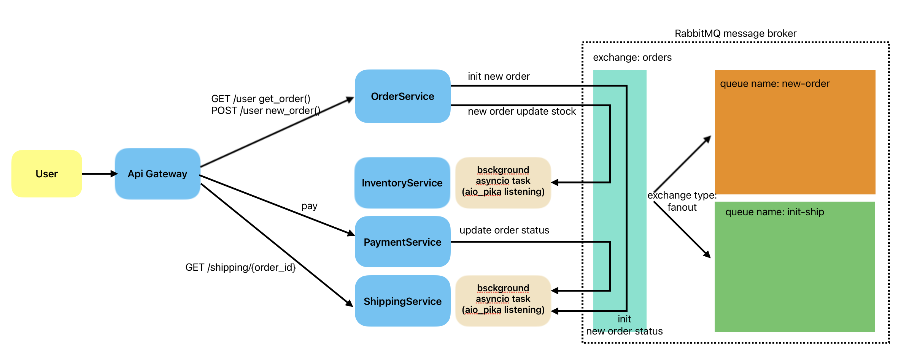

# Microservice Proof of Concept



## Microservice breakdown

基於fastapi實作數個後端服物模擬微服務架構並且使用docker compose控制，訊息佇列的producer和consumer在RabbitMQ容器健康時才會開始運行

## Message Queue

這個POC實作數個後端服務間透過RabbitMQ的訊息佇列溝通，在producer(OrderService)發出訊息時，consumer(InventoryService, Shippingservice)會收到訊息並且執行商業邏輯。

1. OrderService處理訂單查詢以及建立訂單
2. InventoryService於OrderService建立新的訂單時更新庫存
3. ShippingService於OrderService建立新訂單時，進行出貨狀態更新

### Exchange Type

InvSvc, ShiSvc分別監聽著「new-order」和「init-ship」兩個queue，兩者都綁定在「orders」Exchange下，採用Fanout模式廣播訊息

### Life Cycle

下游服務主體為FastAPI後端應用程式，透過FastAPI的lifespan監聽RabbitMQ訊息佇列，監聽也隨著應用程式隨之關閉。
使用asyncio發起非同步Task。

```python
@asynccontextmanager
async def lifespan(app: FastAPI):
    # 啟動非同步監聽consumer程式
    task = asyncio.create_task(consumer.start())
    yield
    # 應用程式生命週期結束
    await consumer.stop()
    task.cancel()
    try:
        await task
    except asyncio.CancelledError:
        pass
# FastAPI lifespan參數
app = FastAPI(lifespan=lifespan)
```

## Api Gateway

提供單一節點做反向代理至後端服務，降低後端服務風險
未來可以加入Authentication, rate limiting